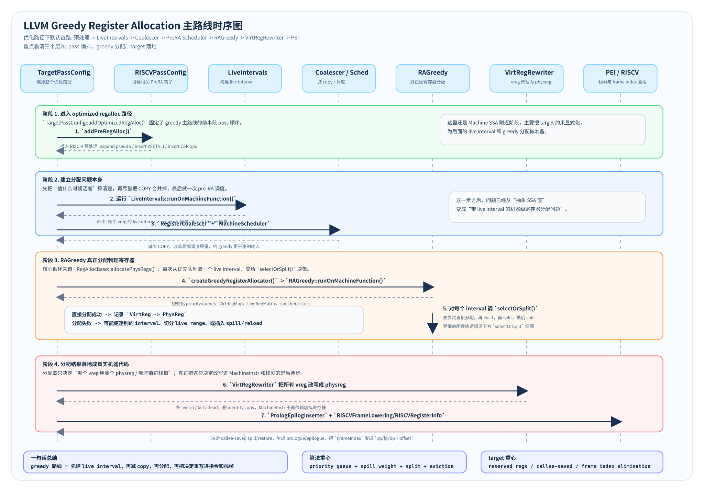
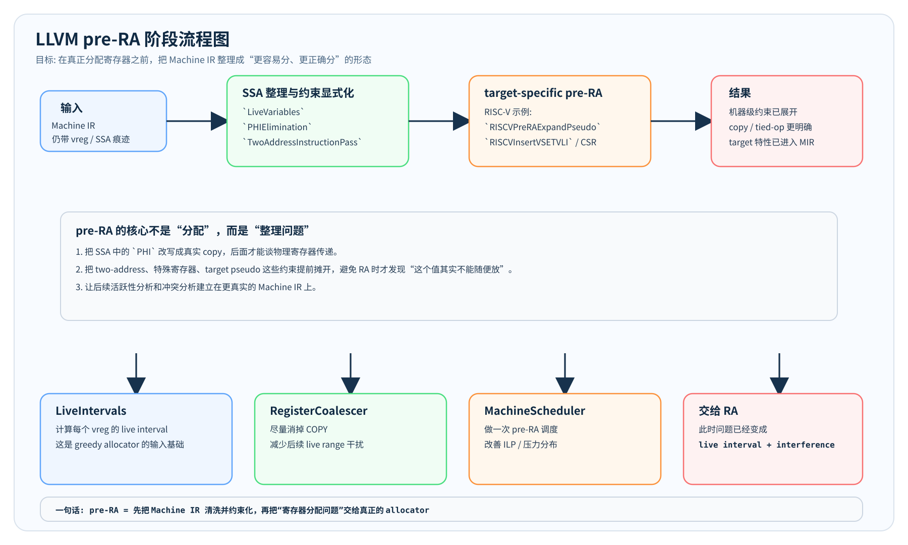
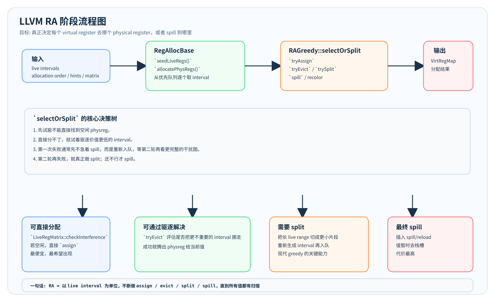
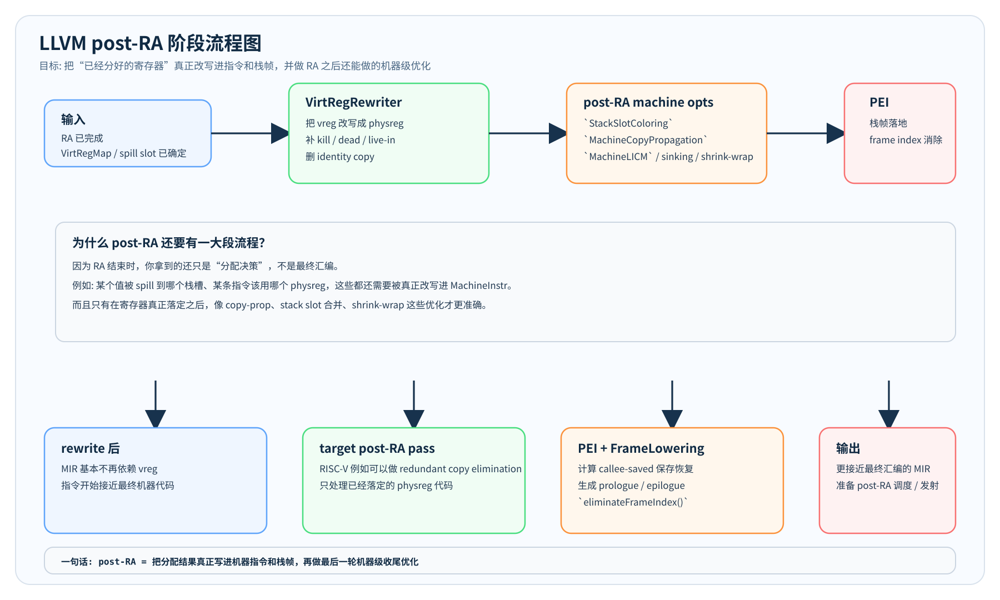
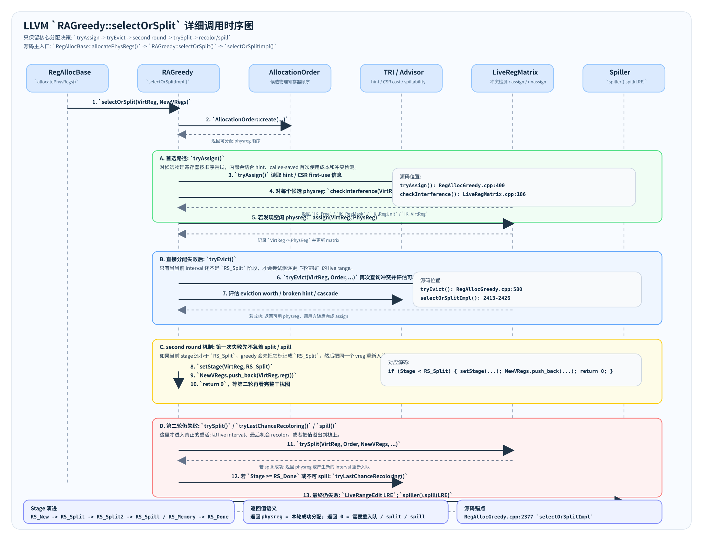

# 寄存器为什么要分配
1.ir有无限的寄存器,便于优化   ir寄存器
2.机器上的寄存器有限(物理限制)  CPU物理寄存器
3.关键  
把hot数据存到寄存器,而cold数据存到内存

# 专业术语
1. assignment 
将ir寄存器映射到物理寄存器
2. coalesing
将多个ir寄存器映射到一个物理寄存器
3. move(成本低)
将一个cpu寄存器移动到另一个寄存器
编译phinodes
packing hot data in the finite set of registers
4. spil(成本高)
将register 数据移动到 dram hot->cold
5. restore(成本高)
将dram 数据移动到 register cold->hot

核心目标 :通过上述方法解决ir寄存器和CPU寄存器数量不匹配的问题

# 难点
如何识别哪些是hot哪些cold数据
1. 找到一个映射最小化spill和restore的cost
2. 映射到cpu上的寄存器是hot,映射到dram的寄存器是cold
3. 因为整个函数都需要考虑,所以是全局问题

静态映射 clang/c的做法
1. 编译时决定映射,找到cost小的映射
2. 根据静态映射将ir转为汇编

动态映射 jit的做法
1. 在程序运行中找到一个好的映射
2. 根据映射反馈优化,反复将ir转为汇编

# 如何找到一个好的映射-问题类比
观察到: 映射问题可以简化为图着色问题
好的映射是一个图着色问题
## 图着色问题
图中的每一个顶点,都要赋予一种颜色,任意两个点,如果有相同的颜色,那么他们之间不能存在边，在此规则上,希望找到一种满足规则的映射,且颜色数量最少
## 冲突图创建
1. 分析ir寄存器的 live range(define-最后的use)
2. 将每一个ir 寄存器映射到一个图中的顶点
3. 如果两个顶点对应的ir寄存器的live range overlay,那么在图中给它们加一条边
如果图的颜色数量小于cpu寄存器的数量,那就是理想状态

## spilling
如果找到的颜色数量要大于cpu寄存器的数量,那么放弃一个ir寄存器,它要被放到dram中
难点： 如何决定哪个ir 寄存器是要被放弃的?
1. 不hot的寄存器
2. 有很大的好处(在冲突图中的邻居很多)

整体算法
1. 构建conflict graph
2. 图着色
3. 如果图的颜色数量小于cpu寄存器的数量,那么结束
4. 否则,放弃一个IR 寄存器然后重新开始

问题1：如何“完美的”找一个IR 寄存器放弃
它和：
图着色（graph coloring）
live range overlap
loop frequency
instruction scheduling
rematerialization
coalescing
全部耦合。一个 spill 决策可能导致：
后面更多 spill
instruction 增多
live range 变长
cache miss

这是全局组合优化,所以现实中没有“完美算法”,只有 heuristic。
现实方法:
1.spill 最少使用的值
2.spill loop 外面的值
3.spill live range 长的值
4.rematerialization 重新计算而不是存储
问题2: spill 是唯一方法吗？
live range splitting,将一个ir寄存器的live range切成多段
现代 allocator：
LLVM Greedy RA
PBQP
Linear Scan with splitting
都大量依赖
live interval splitting

## LLVM Greedy Register Allocator：
核心就是：
priority queue
+ spill weight
+ live interval splitting
+ eviction
+ recoloring

# 算法实现
## draw interference graph
live range:从define到use
1. define支配所有的uses
2. use不能支配其他uses

overlap的条件
d1 dominate d2,d2 dominate u1i
d2 dominate d1,d1 dominate u2i

## coloring interference graph
1. 找到图中这样一个顶点,与他相邻的点(有直线相交)都互相相连,那么这个点与它邻居的颜色都不能相同,只能用剩余/新颜色,这样的点最后处理,因为要等邻居节点
当邻居数<颜色数,则可以直接移除 push
2. 如果没有这样的点?SSA理论上必须会有这样的点
3. 把这个点移除 push ,递归的找下一个这样的点
4. 直到剩一个点后,开始染色 pop
5. 如果已有的颜色数量满足,那么完成
6. 否则,进入spill阶段

选择需要spill的寄存器
1. 如果一个clique(clique是指若干个两两互联的顶点组成的簇) > limit,选择其中一个顶点 spill
2. 如果当需要用新寄存器给顶点染色时,此时没有新的CPU寄存器可用,那么把当前顶点 spill
3. spill一个顶点他的live range 特别长
spill完后,需要重新构建graph


或者其他启发式的算法

## risc-v的约束
1. 函数参数只允许用寄存器存储8个,多的要存在stack/heap中
如@foo(%a,%b)->
@foo(%a',%b')
%a=%a' copy
%b=%b' copy
在计算color时,固定 '%a'到'a0','%b'到'a1'即可

2. caller-saved register not preserved after function calls
如
t0=42,
call @foo() //可能改动t0
那就将对t0的使用改成s0,因为t0是临时寄存器会被callee改变,而s0寄存器要被callee还原

3. 如果ir寄存器使用的数据大于CPU寄存器允许的数据长度
存在stack里
把其split成小的多个寄存器 SROA, scholar replacement of aggregate 聚合体替换

4. 整型寄存器和浮点寄存器是不同的
那么,必须基于类型,给这些ir寄存器染色,如分成两组不同的颜色

# llvm的RA
Greedy Register Allocator
LLVM 为什么不用经典 graph coloring
经典 Chaitin流程：
build interference graph
simplify
spill
rebuild

问题：几十万个 edge 构图非常贵。
spill rebuild 成本高
spill 后：
需要重新建图

split 不自然
高度依赖 live range splitting
graph coloring 不擅长这个。

基于优先队列的ir寄存器 spill
1. spill weight 
“这个 virtual register 值多少钱”
weight 高尽量别 spill  考虑use_count × loop_weight
2. loop depth 执行次数越多,spill 越贵,提高 loop 内变量优先级
3. use density  单位 live range 长度里的 use 密度,保留高 density 的值
4. rematerializable 用计算比load store 更便宜
5. register class 不同类型的数据只能存储在特定的寄存器
spill

为什么 LLVM Machine IR 不是纯 SSA
1. two-address instruction 
add rax, rbx  输入输出必须同寄存器,这不是SSA
2. copies
Machine IR 里大量COPY
v1 -> a0
用于：
calling convention
coalescing
two-address lowering
register constraint
这些 copy导致
live range overlap
3. subregister
寄存器可以部分访问。
例如 x86：
RAX
EAX
AX
AL
AH
其实是同一个物理寄存器的不同部分
LLVM需要建模subregister
例如：
低32位
低16位
低8位
于是 interference不再简单。
例如：
AL 和 AX overlap
AL 和高64位别的部分关系复杂。
4. physreg constraints
某些 instruction 强制使用特定物理寄存器

# Greedy 主路线
如果只看 LLVM 在 `O1+` 下默认走的 greedy 路线，可以把主逻辑整理成 7 步：

1. `TargetPassConfig::addOptimizedRegAlloc()` 负责把 greedy 相关 pass 按固定顺序串起来。
2. `RISCVPassConfig::addPreRegAlloc()` 在 RA 前插入少量目标相关处理，把 RISC-V 约束先显式化。
3. `LiveIntervals` 计算每个虚拟寄存器的 live interval，这是后面判断冲突、切分、spill 的基础。
4. `RegisterCoalescer` 尽量消掉 `COPY`，`MachineScheduler` 做一次 pre-RA 调度，降低后续分配压力。
5. `RAGreedy` 进入核心循环：从优先队列取一个 live interval，尝试直接分配；失败就 evict；再失败就 split；最后才 spill。
6. `VirtRegRewriter` 把 `vreg` 真实改写成 `physreg`，补 live-in / kill / dead 信息。
7. `PEI + RISCVFrameLowering/RISCVRegisterInfo` 负责栈帧落地：保存 callee-saved、生成 prologue/epilogue，并把 `FrameIndex` 改成真实的 `sp/fp/bp + offset`。

这条路线里有两个容易混淆的点：
1. `RAGreedy` 只负责“做分配决策”，并不直接生成完整的最终栈帧代码。
2. RISC-V 主要通过 target hook 参与：定义哪些寄存器能分配、哪些必须保留、spill/栈槽最后怎么落成真实指令。

下面这张图是 greedy 路线的总览图，和后面的 `selectOrSplit` 细图配套看最清楚。



# 分阶段看
如果把整个 greedy 路线再按阶段拆开，可以分成三段：

1. `pre-RA`: 把 Machine IR 整理好，让“寄存器分配问题”变清楚。
2. `RA`: greedy allocator 真正决定每个值去哪个物理寄存器，或者 spill。
3. `post-RA`: 把分配结果落成真实机器代码和栈帧，并做最后一轮机器级优化。

## pre-RA
`pre-RA` 的重点不是分配，而是准备：
1. 消掉 `PHI`，把 SSA 的值传递改成真实 copy。
2. 展开 two-address、target pseudo、特殊寄存器等机器约束。
3. 计算 live interval，尽量 coalesce copy，再做一次 pre-RA 调度。



## RA
`RA` 阶段才是 greedy allocator 的主战场：
1. 从优先队列中取 interval。
2. 先试直接分配。
3. 再试驱逐已有分配。
4. 不行就 split。
5. 最后才 spill。



## post-RA
`post-RA` 负责把“分配结果”真正写进代码里：
1. `VirtRegRewriter` 把 vreg 改成 physreg。
2. 继续做 copy-prop、stack slot coloring、machine LICM 之类只适合在 RA 之后做的优化。
3. `PEI + FrameLowering` 生成 prologue/epilogue，并把 `FrameIndex` 改成真实 `sp/fp/bp + offset`。



# RAGreedy `selectOrSplit`
下面这张图只保留 `RAGreedy::selectOrSplitImpl()` 的核心调用链，省略 debug、verify、remark 这类辅助逻辑。



阅读顺序:
1. `RegAllocBase::allocatePhysRegs()` 从优先队列里取出一个 `LiveInterval`，调用 `selectOrSplit()`。
2. `selectOrSplitImpl()` 先构造 `AllocationOrder`，然后尝试 `tryAssign()`。
3. 如果直接分配失败，并且当前 interval 还没进入 `RS_Split`，会尝试 `tryEvict()`。
4. 如果还是失败，第一次不会马上 spill，而是把 stage 提升到 `RS_Split`，重新入队，等待第二轮。
5. 第二轮再失败，才进入 `trySplit()`；再往后才是 `tryLastChanceRecoloring()` 或 `spill()`。

最重要的源码锚点:
1. `llvm-project/llvm/lib/CodeGen/RegAllocBase.cpp:84` `allocatePhysRegs()`
2. `llvm-project/llvm/lib/CodeGen/RegAllocGreedy.cpp:2377` `selectOrSplitImpl()`
3. `llvm-project/llvm/lib/CodeGen/RegAllocGreedy.cpp:400` `tryAssign()`
4. `llvm-project/llvm/lib/CodeGen/RegAllocGreedy.cpp:580` `tryEvict()`
5. `llvm-project/llvm/lib/CodeGen/RegAllocGreedy.cpp:1768` `trySplit()`
6. `llvm-project/llvm/lib/CodeGen/LiveRegMatrix.cpp:186` `checkInterference()`

# llc 调试路径
`selectOrSplit` 不是一个单独的 pass，所以调试通常分成两层:
1. 用 `-print-before=greedy -print-after=greedy` 看 greedy pass 前后的 MIR。
2. 用 `-debug-only=regalloc` 看 `tryAssign / tryEvict / trySplit / spill` 这些内部决策日志。

当前仓库已经有可执行的 `llc`:
```bash
llvm-project/build/bin/llc --version
```

我在当前环境实际跑通的命令如下。

先看 greedy pass 前后 MIR:
```bash
llvm-project/build/bin/llc \
  -O2 \
  -mtriple=x86_64-unknown-linux-gnu \
  -regalloc=greedy \
  -filter-print-funcs=test \
  -print-before=greedy \
  -print-after=greedy \
  llvm-project/llvm/test/CodeGen/X86/ins_split_regalloc.ll \
  -o /tmp/ins_split_regalloc.s \
  > /tmp/ins_split_regalloc.print 2>&1
```

再看 greedy 内部决策日志:
```bash
llvm-project/build/bin/llc \
  -O2 \
  -mtriple=x86_64-unknown-linux-gnu \
  -regalloc=greedy \
  -debug-only=regalloc \
  -filter-print-funcs=test \
  llvm-project/llvm/test/CodeGen/X86/ins_split_regalloc.ll \
  -o /tmp/ins_split_regalloc.s \
  > /tmp/ins_split_regalloc.debug 2>&1
```

如果你想把范围收得更窄，可以再配合:
```bash
llvm-project/build/bin/llc \
  -O2 \
  -mtriple=x86_64-unknown-linux-gnu \
  -regalloc=greedy \
  -stop-before=greedy \
  llvm-project/llvm/test/CodeGen/X86/ins_split_regalloc.ll \
  -o /tmp/before-greedy.mir
```

```bash
llvm-project/build/bin/llc \
  -O2 \
  -mtriple=x86_64-unknown-linux-gnu \
  -regalloc=greedy \
  -stop-after=greedy \
  llvm-project/llvm/test/CodeGen/X86/ins_split_regalloc.ll \
  -o /tmp/after-greedy.mir
```

## 当前环境说明
当前这份 `llc` build 里没有编进 `riscv32/riscv64` target，所以我把“能实际跑通”的调试路径写成了 X86 版本，用来观察通用 greedy RA 逻辑。

如果你后面把 RISC-V target 编进来，命令基本不变，只需要替换:
```bash
-mtriple=riscv64-unknown-linux-gnu
```

然后把输入测试替换成你自己的 RISC-V `.ll` / `.mir` 文件即可。
